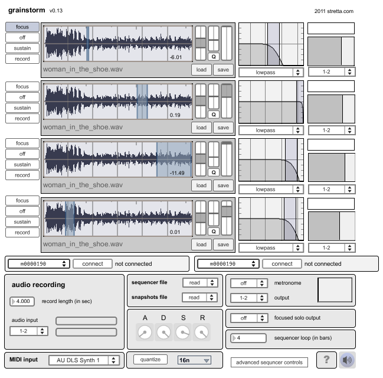

# grainstorm

created by: **stretta**

grainstorm is a four voice granular synthesizer for grid and arc. grainstorm maps all functions to a 64-button size monome so any monome grid will work. Both arc2s and arc4s may be used but arc4s provide additional control over grain duration, volume and filter.

